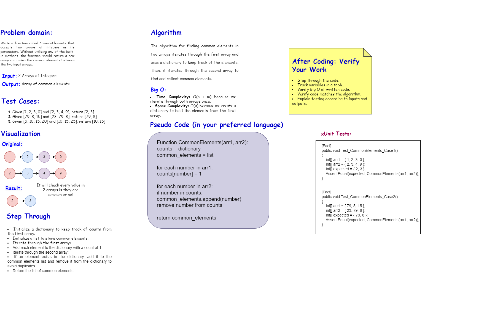

# Challenge 06-A: Common Elements

## Problem Domain
Write a function called `FindCommonElements` that accepts two arrays of integers as its parameters. Without utilizing any of the built-in methods, the function should return a new array containing the common elements between the two input arrays.

## Example
- Input: [1, 2, 3, 0], [2, 3, 4, 9]
  Output: [2, 3]

- Input: [79, 8, 15], [23, 79, 8]
  Output: [79, 8]

- Input: [5, 10, 15, 20], [10, 15, 25]
  Output: [10, 15]

## Console Output

