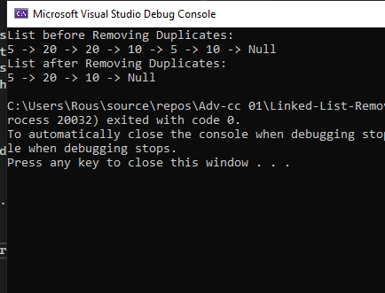

# Remove Duplicates from Linked List

## Problem Domain
Given a linked list, remove all duplicate nodes from the list.

## Inputs and Expected Outputs
| Input | Expected Output |
|-------|------------------|
| 5 -> 20 -> 20 -> 10 -> 5 -> 10 -> Null | 5 -> 20 -> 10 -> Null |
| 1 -> 2 -> 3 -> 2 -> 4 -> 3 -> Null | 1 -> 2 -> 3 -> 4 -> Null |
| 7 -> 7 -> 7 -> 7 -> Null | 7 -> Null |

## Edge Cases
- An empty list
- A list with no duplicates
- A list where all elements are duplicates

## Algorithm
1. Initialize the current node as the head.
2. For each node, initialize another pointer to check the rest of the list for duplicates.
3. If a duplicate is found, adjust the next pointer to skip over the duplicate.
4. Continue this process until the end of the list is reached.

## Big O Time/Space Complexity
- Time Complexity: O(n^2) due to the nested loop for checking duplicates.
- Space Complexity: O(1) as no additional space is used.

## Screenshot of Console Output


## Whiteboard Visual


## Code Implementation

```csharp
using System;
using System.Collections.Generic;
using System.Linq;
using System.Text;
using System.Threading.Tasks;

namespace Linked_List_Remove_Duplicates
{
    public class LinkedList
    {
        public Node HeadNode { get; set; }

        public void Insert(int value)
        {
            Node newNode = new Node(value);
            if (HeadNode == null)
            {
                HeadNode = newNode;
            }
            else
            {
                Node currentNode = HeadNode;
                while (currentNode.NextNode != null)
                {
                    currentNode = currentNode.NextNode;
                }
                currentNode.NextNode = newNode;
            }
        }

        public void DeleteDuplicates()
        {
            Node currentNode = HeadNode;
            while (currentNode != null)
            {
                Node runnerNode = currentNode;
                while (runnerNode.NextNode != null)
                {
                    if (runnerNode.NextNode.DataValue == currentNode.DataValue)
                    {
                        runnerNode.NextNode = runnerNode.NextNode.NextNode;
                    }
                    else
                    {
                        runnerNode = runnerNode.NextNode;
                    }
                }
                currentNode = currentNode.NextNode;
            }
        }

        public void PrintList()
        {
            Node currentNode = HeadNode;
            while (currentNode != null)
            {
                Console.Write(currentNode.DataValue + " -> ");
                currentNode = currentNode.NextNode;
            }
            Console.WriteLine("Null");
        }
    }
}

using System;
using System.Collections.Generic;
using System.Linq;
using System.Text;
using System.Threading.Tasks;

namespace Linked_List_Remove_Duplicates
{
    public class Node
    {
        public int DataValue { get; set; }
        public Node NextNode { get; set; }

        public Node(int value)
        {
            DataValue = value;
            NextNode = null;
        }
    }
}

namespace Linked_List_Remove_Duplicates
{
    public class Program
    {
        static void Main(string[] args)
        {
            LinkedList list = new LinkedList();
            list.Insert(5);
            list.Insert(20);
            list.Insert(20);
            list.Insert(10);
            list.Insert(5);
            list.Insert(10);
            Console.WriteLine("List before Removing Duplicates:");
            list.PrintList();

            list.DeleteDuplicates();
            Console.WriteLine("List after Removing Duplicates:");
            list.PrintList();
        }
    }
}
using System;
using Xunit;
using Linked_List_Remove_Duplicates; // Use your custom namespace for the LinkedList class

namespace TestProject
{
    public class RemoveDuplicatesTests
    {
        [Fact]
        public void Test_NoDuplicates()
        {
            LinkedList TestList = new LinkedList();
            TestList.Insert(1);
            TestList.Insert(2);
            TestList.Insert(3);
            TestList.DeleteDuplicates();
            Assert.Equal("1 -> 2 -> 3 -> Null", GetListString(TestList));
        }

        [Fact]
        public void Test_WithDuplicates()
        {
            LinkedList TestList = new LinkedList();
            TestList.Insert(1);
            TestList.Insert(2);
            TestList.Insert(2);
            TestList.Insert(3);
            TestList.Insert(3);
            TestList.DeleteDuplicates();
            Assert.Equal("1 -> 2 -> 3 -> Null", GetListString(TestList));
        }

        [Fact]
        public void Test_AllDuplicates()
        {
            LinkedList TestList = new LinkedList();
            TestList.Insert(7);
            TestList.Insert(7);
            TestList.Insert(7);
            TestList.DeleteDuplicates();
            Assert.Equal("7 -> Null", GetListString(TestList));
        }

        private string GetListString(LinkedList testList)
        {
            Node currentNode = testList.HeadNode;
            string result = string.Empty;
            while (currentNode != null)
            {
                result += currentNode.DataValue + " -> ";
                currentNode = currentNode.NextNode;
            }
            result += "Null";
            return result;
        }
    }
}

