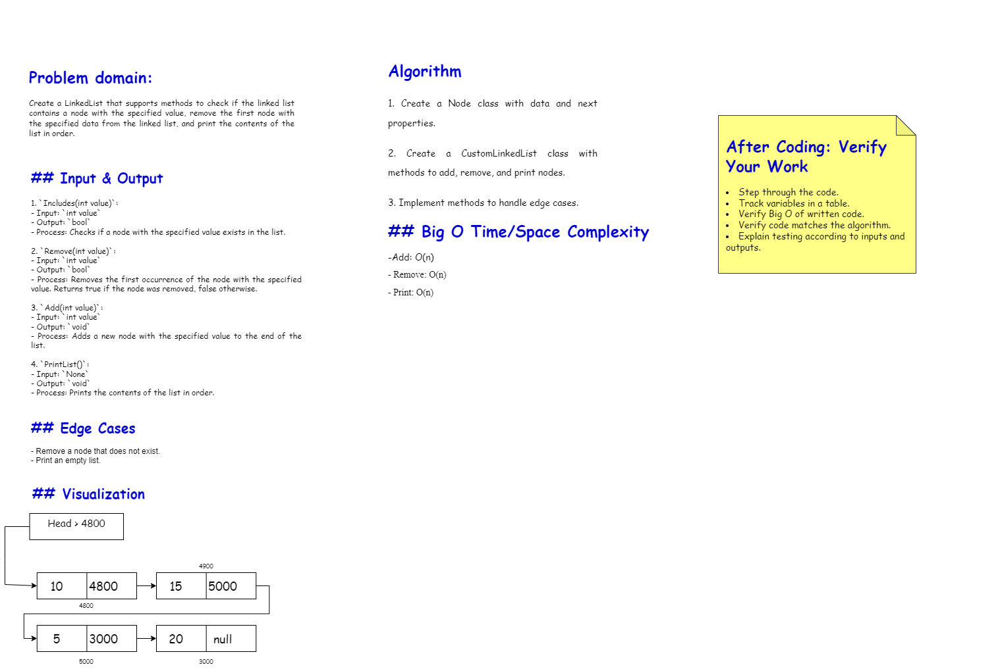
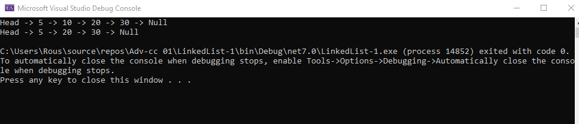

# Linked List Implementation

## Problem Domain
Implement a basic singly linked list data structure in C#.

## Inputs and Expected Outputs
- **Add Nodes:** Ability to add nodes to the linked list.
- **Remove Nodes:** Ability to remove nodes from the linked list.
- **Print List:** Print the contents of the linked list.

## Edge Cases
- **Removing Non-existent Node:** Handle cases where a node to be removed does not exist.
- **Empty List:** Print an empty list appropriately.

## Visual
Below is a diagram illustrating the structure of the linked list and the operations:

- **Adding a Node:** Shows how a node is added to the end of the list.
- **Removing a Node:** Shows the removal of a node from the list.
- **Printing the List:** Displays the sequence of nodes in the list.

## Algorithm
1. **Add Node:**
   - Create a new node with the given data.
   - If the list is empty, set the head to the new node.
   - Otherwise, traverse to the end of the list and set the next pointer of the last node to the new node.
2. **Remove Node:**
   - If the list is empty, do nothing.
   - If the head node contains the data, set the head to the next node.
   - Otherwise, traverse the list to find the node with the given data and adjust the pointers to exclude that node.
3. **Print List:**
   - Traverse the list from the head and print each node’s data.

## Pseudo Code (C# style)

// Node class
class Node {
    int data;
    Node next;
    Node(int data) {
        this.data = data;
        this.next = null;
    }
}

// LinkedList class
class LinkedList {
    Node head;

    // Add a node to the list
    void Add(int data) {
        Node newNode = new Node(data);
        if (head == null) {
            head = newNode;
        } else {
            Node current = head;
            while (current.next != null) {
                current = current.next;
            }
            current.next = newNode;
        }
    }

    // Check if a node with specified data is in the list
    bool Includes(int data) {
        Node current = head;
        while (current != null) {
            if (current.data == data) {
                return true;
            }
            current = current.next;
        }
        return false;
    }

    // Remove the first node with specified data
    void Remove(int data) {
        if (head == null) return;

        if (head.data == data) {
            head = head.next;
            return;
        }

        Node current = head;
        while (current.next != null) {
            if (current.next.data == data) {
                current.next = current.next.next;
                return;
            }
            current = current.next;
        }
    }

    // Print the contents of the list
    void PrintList() {
        Node current = head;
        Console.Write("Head");
        while (current != null) {
            Console.Write(" -> " + current.data);
            current = current.next;
        }
        Console.WriteLine(" -> Null");
    }
}

## Big O Time/Space Complexity
- **Add:** O(n) because we might need to traverse the entire list.
- **Remove:** O(n) because we might need to traverse the entire list.
- **Print:** O(n) because we need to traverse the entire list.

## Console Output
Below is an example of the console output for adding and removing nodes:

