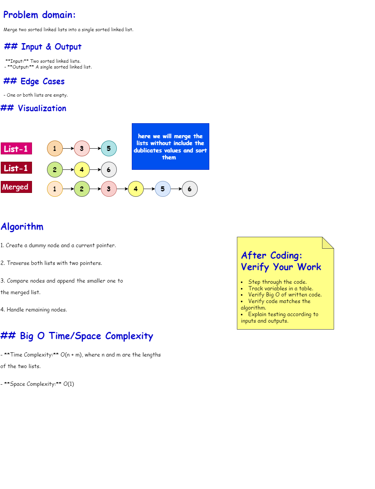
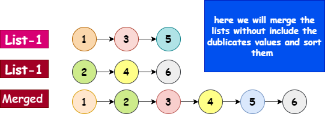
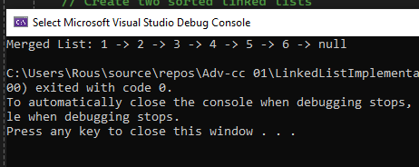

# Merge Sorted Linked Lists

## Whiteboard 



## Problem Domain
Merge two sorted linked lists into a single sorted linked list.

## Inputs and Expected Outputs
- **Input:** Two sorted linked lists.
- **Output:** A single sorted linked list.

## Edge Cases
- One or both lists are empty.

## Visual


## Algorithm
1. Create a dummy node and a current pointer.
2. Traverse both lists with two pointers.
3. Compare nodes and append the smaller one to the merged list.
4. Handle remaining nodes.

## Real Code
Refer to `LinkedList.cs`.

## Big O Time/Space Complexity
- **Time Complexity:** O(n + m), where n and m are the lengths of the two lists.
- **Space Complexity:** O(1)

## Console Output


---

# Detailed Requirements
Use your previous linked list implementation to include a method for merging two sorted linked lists into a single sorted linked list.

## Requirements
- Utilize the existing `Node` and `LinkedList` classes from your previous implementation.
- Implement a new method `MergeSortedLists()` in your `LinkedList` class:
  - Use two pointers (`current1` for list 1 and `current2` for list 2) to traverse both linked lists.
  - Compare the values of nodes pointed by `current1` and `current2`.
  - Append the smaller node to the merged list and move the pointer (`current1` or `current2`) forward.
  - Handle cases where one list might reach the end before the other.
  - Ensure to handle edge cases like empty lists.
  - Handle all exceptions that could be thrown during execution.

## Examples
### Example 1
**Input:**
- List 1: `Head -> 1 -> 3 -> 5 -> Null`
- List 2: `Head -> 2 -> 4 -> 6 -> Null`

**Output:**
- Merged List: `1 -> 2 -> 3 -> 4 -> 5 -> 6 -> Null`

### Example 2
**Input:**
- List 1: `Head -> 5 -> 10 -> 15 -> Null`
- List 2: `Head -> 2 -> 3 -> 20 -> Null`

**Output:**
- Merged List: `Head -> 2 -> 3 -> 5 -> 10 -> 15 -> 20 -> Null`

### Example 3
**Input:**
- List 1: `Head -> 10 -> 20 -> 30 -> Null`
- List 2: `Head -> 5 -> 15 -> 25 -> 35 -> Null`

**Output:**
- Merged List: `Head -> 5 -> 10 -> 15 -> 20 -> 25 -> 30 -> 35 -> Null`

## Unit Tests with xUnit
Create a new test file for this challenge: `MergeSortedLinkedLists.cs`. Verify the following test cases:
- Test merging when one list is empty.
- Test merging when both lists are empty.
- Test merging List 1 and List 2 from the second example. (`Head -> 2 -> 3 -> 5 -> 10 -> 15 -> 20 -> Null`)

## Implementation

### Node Class
```csharp
namespace LinkedListImplementation
{
    public class Node
    {
        public int Value { get; set; }
        public Node Next { get; set; }

        public Node(int value)
        {
            Value = value;
            Next = null;
        }
    }
}
```
### LinkedList Class
```csharp
using System;

namespace LinkedListImplementation
{
    public class LinkedList
    {
        public Node Head { get; set; }

        public LinkedList()
        {
            Head = null;
        }

        public void Add(int value)
        {
            Node newNode = new Node(value);
            if (Head == null)
            {
                Head = newNode;
            }
            else
            {
                Node current = Head;
                while (current.Next != null)
                {
                    current = current.Next;
                }
                current.Next = newNode;
            }
        }

        public LinkedList MergeSortedLists(LinkedList list1, LinkedList list2)
        {
            Node dummy = new Node(0);
            Node tail = dummy;

            Node current1 = list1.Head;
            Node current2 = list2.Head;

            while (current1 != null && current2 != null)
            {
                if (current1.Value <= current2.Value)
                {
                    tail.Next = current1;
                    current1 = current1.Next;
                }
                else
                {
                    tail.Next = current2;
                    current2 = current2.Next;
                }
                tail = tail.Next;
            }

            if (current1 != null)
            {
                tail.Next = current1;
            }
            else
            {
                tail.Next = current2;
            }

            LinkedList mergedList = new LinkedList();
            mergedList.Head = dummy.Next;
            return mergedList;
        }

        public void RemoveDuplicates()
        {
            if (Head == null)
                return;

            Node current = Head;

            while (current != null && current.Next != null)
            {
                if (current.Value == current.Next.Value)
                {
                    current.Next = current.Next.Next;
                }
                else
                {
                    current = current.Next;
                }
            }
        }

        public override string ToString()
        {
            Node current = Head;
            string result = "";
            while (current != null)
            {
                result += $"{current.Value} -> ";
                current = current.Next;
            }
            result += "null";
            return result;
        }
    }
}
```
### Program Class
```csharp
using System;
using LinkedListImplementation;

namespace MergeSortedLinkedLists
{
    class Program
    {
        static void Main(string[] args)
        {
            // Create two sorted linked lists
            LinkedList list1 = new LinkedList();
            list1.Add(1);
            list1.Add(3);
            list1.Add(5);

            LinkedList list2 = new LinkedList();
            list2.Add(2);
            list2.Add(4);
            list2.Add(6);

            // Merge the lists
            LinkedList mergedList = list1.MergeSortedLists(list1, list2);

            // Display the merged list
            Console.WriteLine("Merged List: " + mergedList.ToString());
        }
    }
}
```
### XunitTest Class
```csharp
using Xunit;
using LinkedListImplementation;

public class MergeSortedLinkedListsTests
{
    [Fact]
    public void Test_MergingWhenOneListIsEmpty()
    {
        // Arrange
        LinkedList list1 = new LinkedList();
        list1.Add(1);
        list1.Add(3);
        list1.Add(5);

        LinkedList list2 = new LinkedList();

        // Act
        LinkedList mergedList = list1.MergeSortedLists(list1, list2);

        // Assert
        Assert.Equal("1 -> 3 -> 5 -> null", mergedList.ToString());
    }

    [Fact]
    public void Test_MergingWhenBothListsAreEmpty()
    {
        // Arrange
        LinkedList list1 = new LinkedList();
        LinkedList list2 = new LinkedList();

        // Act
        LinkedList mergedList = list1.MergeSortedLists(list1, list2);

        // Assert
        Assert.Null(mergedList.Head);
    }

    [Fact]
    public void Test_MergingExampleLists()
    {
        // Arrange
        LinkedList list1 = new LinkedList();
        list1.Add(5);
        list1.Add(10);
        list1.Add(15);

        LinkedList list2 = new LinkedList();
        list2.Add(2);
        list2.Add(3);
        list2.Add(20);

        // Act
        LinkedList mergedList = list1.MergeSortedLists(list1, list2);

        // Assert
        Assert.Equal("2 -> 3 -> 5 -> 10 -> 15 -> 20 -> null", mergedList.ToString());
    }
}
````
