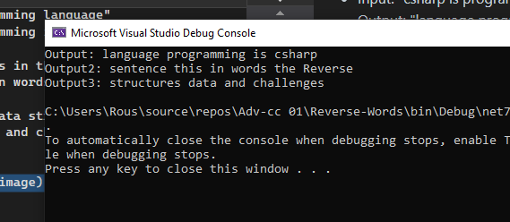

# Challenge 6-B: Reverse Words
### Table of Contents

- [Whiteboard Images](ReverseWords.drawio.png)
- [Challenge 06-B: Reverse Words](Challenges/Reverse-Words/Readme.md)

## Problem Domain
Write a function called ReverseWords that accepts a string as its parameter. The function should reverse the order of the words in the string and return the resulting string. Words are defined as sequences of characters separated by spaces.

## Example
- Input: "csharp is programming language"
  Output: "language programming is csharp"

- Input: "Reverse the words in this sentence"
  Output: "sentence this in words the Reverse"

- Input: "challenges and data structures"
  Output: "structures data and challenges"

## Console Output

## Unit Tests
Use [Fact] to verify the following cases:
- Test case 1: "csharp is programming language" should return "language programming is csharp"
- Test case 2: "Reverse the words in this sentence" should return "sentence this in words the Reverse".
- Test case 3: "challenges and data structures" should return "structures data and challenges".

